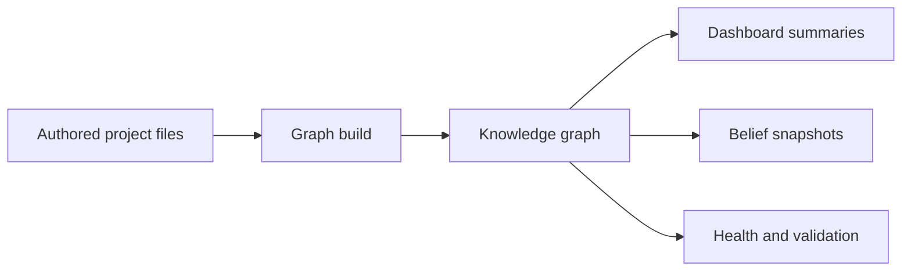

# User Guide Restructure Implementation Plan

> **For agentic workers:** REQUIRED SUB-SKILL: Use superpowers:subagent-driven-development (recommended) or superpowers:executing-plans to implement this plan task-by-task. Steps use checkbox (`- [ ]`) syntax for tracking.

**Goal:** Replace the overlapping single-page guide and model docs with a canonical chaptered user guide under `docs/user-guide/`, update all live references, and add tests that keep command docs and entity-kind documentation aligned with code.

**Architecture:** Add the new guide tree first, with content split by user-facing responsibility. Then update README, command docs, canonical skills, generated Codex skills, and tests to point at the new chapters before deleting the retired docs. The entity-kind list in the guide is treated as a contract checked against `CORE_PROFILE`.

**Tech Stack:** Markdown docs, Python tests with `pytest`, Science model descriptors from `science/model/src/science_model/profiles/core.py`, generated Codex skills via `scripts/generate_codex_skills.py`.

---

## File Structure

### Create

- `docs/user-guide/index.md` - canonical guide landing page.
- `docs/user-guide/introduction.md` - what Science does and how users enter it.
- `docs/user-guide/science-model.md` - user-facing model derived from `meta/entities/hypotheses/0007-working-model.md`.
- `docs/user-guide/project-layout.md` - steady-state project filesystem and manifest/tooling split.
- `docs/user-guide/entities.md` - entity file anatomy and core entity kinds by class.
- `docs/user-guide/epistemic-model.md` - propositions, hypotheses, belief, uncertainty, and integrity.
- `docs/user-guide/evidence-lines.md` - evidence-line authoring and evidence vocabulary.
- `docs/user-guide/graph-and-derived-state.md` - graph build, materialization, snapshots, and derived reports.
- `docs/user-guide/health-and-validation.md` - validation, health, needs-review, and honest warning states.
- `docs/user-guide/agent-workflows.md` - Claude/Codex/CLI command map.
- `docs/user-guide/cross-project-work.md` - peers, sync, federation, and cross-project work.
- `science/tests/test_user_guide_docs.py` - guide drift tests, including entity-kind grouping against `CORE_PROFILE`.

### Modify

- `README.md` - point to `docs/user-guide/index.md` and remove deleted doc references.
- `commands/add-hypothesis.md` - read `docs/user-guide/epistemic-model.md`.
- `commands/compare-hypotheses.md` - read `docs/user-guide/epistemic-model.md`.
- `commands/interpret-results.md` - read `docs/user-guide/epistemic-model.md` and `docs/user-guide/evidence-lines.md`.
- `commands/status.md` - point optional model context at `docs/user-guide/epistemic-model.md`.
- `commands/health.md` - replace model-doc link with `docs/user-guide/evidence-lines.md`.
- `commands/create-graph.md` - read `docs/user-guide/science-model.md`, `docs/user-guide/entities.md`, and `docs/user-guide/graph-and-derived-state.md`.
- `commands/update-graph.md` - same graph/read targets as `create-graph`.
- `commands/sketch-model.md` - same graph/model read targets.
- `commands/specify-model.md` - same graph/model read targets.
- `commands/critique-approach.md` - same graph/model read targets.
- `commands/plan-pipeline.md` - same graph/model read targets.
- `commands/review-pipeline.md` - same graph/model read targets.
- `skills/research/SKILL.md` - replace old model-doc reference with guide chapters.
- `skills/research/proposition-schema.md` - replace old model-doc reference.
- `skills/writing/SKILL.md` - replace old model-doc reference.
- `science/tests/test_command_docs.py` - assert new read targets and reject old paths.
- `science/tests/test_codex_skills.py` - assert generated skills no longer reference deleted docs.
- `meta/entities/hypotheses/0007-working-model.md` - re-point current model-doc citations to the new guide.
- `codex-skills/**` - regenerated output from `scripts/generate_codex_skills.py`.

### Delete

- `docs/user-guide.md`
- `docs/project-organization-profiles.md`
- `docs/conventions/project-working-model-h00.md`
- `docs/proposition-and-evidence-model.md`
- `docs/claim-and-evidence-model.md`

Historical plan/audit files may retain old paths when describing past work, but no live guide, README, command, canonical skill, generated skill, or test should present those paths as current.

---

## Task 1: Add The New Guide Tree

**Files:**
- Create: `docs/user-guide/index.md`
- Create: `docs/user-guide/introduction.md`
- Create: `docs/user-guide/science-model.md`
- Create: `docs/user-guide/project-layout.md`
- Create: `docs/user-guide/entities.md`
- Create: `docs/user-guide/epistemic-model.md`
- Create: `docs/user-guide/evidence-lines.md`
- Create: `docs/user-guide/graph-and-derived-state.md`
- Create: `docs/user-guide/health-and-validation.md`
- Create: `docs/user-guide/agent-workflows.md`
- Create: `docs/user-guide/cross-project-work.md`

- [ ] **Step 1: Create the guide directory**

Run:

```bash
mkdir -p docs/user-guide
```

Expected: command succeeds and `docs/user-guide/` exists.

- [ ] **Step 2: Add `docs/user-guide/index.md`**

Create the file with this content:

```markdown
# Science User Guide

Science helps Claude and Codex users keep research work explicit, skeptical,
and durable. It records questions, hypotheses, propositions, evidence, analyses,
graph summaries, and project health in version-controlled project files.

This guide is the canonical user-facing manual for Science. It explains the
project model, the entity system, the epistemic model, evidence authoring,
derived graph state, validation, agent workflows, and cross-project work.

## Reading Path

1. Start with [Introduction](introduction.md) and [Science Model](science-model.md).
2. Learn [Project Layout](project-layout.md) and [Entities](entities.md).
3. Learn the [Epistemic Model](epistemic-model.md) and [Evidence Lines](evidence-lines.md).
4. Learn [Graph And Derived State](graph-and-derived-state.md), [Health And Validation](health-and-validation.md), [Agent Workflows](agent-workflows.md), and [Cross-Project Work](cross-project-work.md).

## Chapters

| Chapter | Purpose |
|---|---|
| [Introduction](introduction.md) | What Science helps users do and how Claude, Codex, and the CLI fit together. |
| [Science Model](science-model.md) | The big-picture model: authored sources, derived graph views, epistemic neighborhoods, provenance, and federation. |
| [Project Layout](project-layout.md) | The steady-state filesystem, `science.yaml`, `pyproject.toml`, and source/generated boundaries. |
| [Entities](entities.md) | What entity files look like and which core entity kinds Science understands. |
| [Epistemic Model](epistemic-model.md) | Propositions, hypotheses, observations, belief states, contestation, fragility, and evidence integrity. |
| [Evidence Lines](evidence-lines.md) | How to author durable support or dispute with provenance, role, strength, and independence. |
| [Graph And Derived State](graph-and-derived-state.md) | How authored files become graph state, summaries, snapshots, and reports. |
| [Health And Validation](health-and-validation.md) | Validation, health checks, needs-review, freshness, and honest warning states. |
| [Agent Workflows](agent-workflows.md) | Command map for Claude slash commands, Codex skills, and core CLI commands. |
| [Cross-Project Work](cross-project-work.md) | Peers, sync, project collections, and federated Science projects. |

## Core Loop

```text
question -> hypothesis -> proposition -> evidence line -> graph build ->
dashboard summary -> inquiry / analysis planning -> validation / health
```

That path is a teaching spine, not a required order. Real research is nonlinear:
you may start from a paper, dataset, failed analysis, causal concern, or health
warning, then loop through the same concepts in a different order.
```

- [ ] **Step 3: Add `docs/user-guide/introduction.md`**

Create the file with this content:

```markdown
# Introduction

Science is both an agent workflow package and local project tooling for research
work. Claude and Codex workflows are the primary user interface; the `science`
CLI supports durable file creation, validation, graph materialization, evidence
summaries, synchronization, and project health.

Science is skeptical by default:

- hypotheses are organizing conjectures;
- propositions are the main belief-bearing assertions;
- evidence supports or disputes propositions rather than proving them outright;
- uncertainty, contestation, and fragility stay visible;
- literature, data, and causal provenance should be explicit.

## How Users Enter The System

Claude users invoke Science as slash commands:

```text
/science:<command>
```

Codex users invoke generated skills:

```text
science-<command>
```

The CLI form is:

```text
science <group> <command>
```

In normal use, the agent workflows guide the conversation and call the CLI when
work needs to create or validate durable project artifacts.

## One Possible Research Loop

```text
create/import project -> status -> research-topic/search-literature ->
add-hypothesis -> proposition/evidence lines -> graph build ->
dashboard summary -> validate/health -> next-steps
```

Research is usually nonlinear. Start where the work actually starts: a paper, a
dataset, a question, a failed model, a surprising result, or a project-health
warning. Science keeps the resulting claims, evidence, provenance, and next
actions explicit.

## Durable Sources First

Authored state lives in source files. Derived graph files, summaries, snapshots,
and health reports should be rebuilt from those sources. If the graph is wrong,
fix the source artifact and rebuild the graph rather than patching generated
TriG directly.
```

- [ ] **Step 4: Add `docs/user-guide/science-model.md`**

Create the file with this content:

````markdown
# Science Model

Science represents research as authored project files plus derived views over
those files. The model is designed for work where claims are uncertain, evidence
has provenance, and the current state of belief should remain inspectable.

## Big Picture



The authored files are the source of truth. The graph, summaries, snapshots, and
health outputs are derived readings of those files.

## Substrate

The substrate is the storage and representation layer:

- Markdown entity files with YAML frontmatter for durable authored records.
- Bibliography and source records for provenance.
- Graph materialization into named graph files under `knowledge/`.
- Derived reports, dashboards, health checks, and snapshots.

Science uses the graph as a queryable view, not as the primary authoring surface.

## Entities And Relations

An entity is a typed record such as `hypothesis:h01-example`,
`proposition:example`, `evidence-line:example`, `dataset:example`, or
`paper:Example2026`. Relations connect entities: a question can be addressed by
a proposition, an evidence line can support or dispute a proposition, and a
workflow run can produce a data package.

Entities are grouped into broad classes:

- **Epistemic:** records that carry or organize uncertain knowledge.
- **Operational:** work products, sources, datasets, plans, runs, and project
  machinery.
- **Reference:** concepts, variables, outcomes, topics, articles, and other
  referenced objects.

## Epistemic Neighborhoods

Science's working model is a federated patchwork of small epistemic
neighborhoods. A neighborhood is a local cluster around some research concern:
a question, hypothesis, proposition, inquiry, dataset, method, evidence cluster,
or analysis result.

Each neighborhood can carry:

- domain objects and variables;
- propositions about those objects;
- evidence lines and observations;
- provenance for sources and methods;
- derived belief and uncertainty;
- links to neighboring questions, projects, or shared vocabularies.

This is the user-facing version of the `h00` working model. The full `h00`
artifact remains a design and research record; this guide teaches the stable
operational shape.

## Project And Domain Boundaries

Science separates several surfaces:

| Surface | Purpose |
|---|---|
| Domain | The real-world objects, variables, systems, and concepts being studied. |
| Epistemic | Propositions, hypotheses, evidence, observations, inquiries, and belief state. |
| Operational | Tasks, plans, datasets, workflow runs, methods, sources, and project machinery. |
| Reference | Stable identifiers for cited or reused concepts, topics, variables, outcomes, and articles. |
| Generated | Graphs, dashboards, snapshots, grounding reports, and health outputs derived from authored state. |

Keeping these surfaces separate makes it harder to accidentally treat a source,
task, or generated report as evidence by itself.

## Federation

Science projects can connect through peers and shared references. The long-term
shape is:

```text
patch subset project subset project collection
```

Within one project, patches help local reasoning stay interpretable. Across
projects, federation lets related patches and references be compared or synced
without flattening every project into one undifferentiated graph.
````

- [ ] **Step 5: Add `docs/user-guide/project-layout.md`**

Create the file with this content:

```markdown
# Project Layout

Science-managed projects use a small set of stable roots. The exact research or
software stack can vary, but the Science-managed context should remain easy for
agents and humans to find.

## Common Roots

| Path | Purpose |
|---|---|
| `science.yaml` | Science project manifest: profile, aspects, ontologies, peers, and knowledge-profile configuration. |
| `pyproject.toml` | Project-local Python/tooling manifest so `uv run science ...` and validation resolve consistently. |
| `AGENTS.md` / `CLAUDE.md` | Operational instructions for agents. |
| `README.md` | Project front door. |
| `doc/` | Research notes, background, interpretations, reports, discussions, and other prose. |
| `specs/` | Hypotheses, propositions, plans, and structured project specifications when a project keeps them there. |
| `tasks/` | Active, blocked, deferred, retired, and completed work. |
| `knowledge/` | Generated graph files, summaries, snapshots, and other derived knowledge artifacts. |
| `papers/references.bib` | Bibliography entries for cited literature. |
| `.ai/` | Optional project-specific prompts, templates, and overrides. |

## `science.yaml` And `pyproject.toml`

`science.yaml` tells Science what kind of project this is and which knowledge
profiles, aspects, ontologies, and peers are active.

Example:

```yaml
profile: research
layout_version: 2
aspects:
  - computational-analysis
ontologies: [biolink]
knowledge_profiles:
  local: local
```

`pyproject.toml` is the local tooling manifest. Managed projects use it so
commands such as `uv run science validate` and `uv run science graph build`
resolve the same `science` tooling in the same environment.

## Source And Generated Artifacts

Authored source files are where durable project meaning lives. Generated files
are rebuilt from source.

Common generated artifacts include:

- `knowledge/graph.trig`
- dashboard summaries
- belief snapshots
- migration or health reports
- prose grounding and health artifacts

Do not hand-edit generated graph state as the durable fix. Fix the source entity,
source document, bibliography entry, or project manifest, then rebuild.

## Profiles And Aspects

Science supports research-first and software-first projects. A project's
`profile` selects the broad layout expectations. `aspects` are explicit behavior
or domain modifiers such as `hypothesis-testing`, `computational-analysis`, or
`software-development`.

Use the profile for layout. Use aspects for workflow behavior.
```

- [ ] **Step 6: Add `docs/user-guide/entities.md`**

Create the file with this content. The kind lists below must match
`CORE_PROFILE` as of this plan; Task 2 adds the drift test.

````markdown
# Entities

An entity is a durable typed record in a Science project. Most entities are
Markdown files with YAML frontmatter and body prose. The frontmatter provides
machine-readable identity and relationships; the body provides human-readable
context.

## Entity Shape

```markdown
---
id: proposition:example
type: proposition
title: "Example proposition"
status: draft
related:
  - hypothesis:h01-example
source_refs:
  - paper:Example2026
created: "2026-06-20"
updated: "2026-06-20"
---

# Example proposition

This body explains the proposition, scope, caveats, and evidence needs.
```

Important fields:

| Field | Purpose |
|---|---|
| `id` | Stable typed reference, usually `<kind>:<local-part>`. |
| `type` | Entity kind. Usually matches the prefix in `id`. |
| `title` | Human-readable title. |
| `status` | Lifecycle state for the kind. |
| `related` | Other entity refs connected to this record. |
| `source_refs` | Sources or annotations that support the existence or content of this record. |
| Body prose | Explanation, caveats, rationale, and review context. |

## Authored And Derived Fields

Authored fields are recorded directly in source files. Derived fields are
computed from the graph, evidence, provenance, or health machinery. Belief
state, support summaries, dispute summaries, freshness, and health status should
be recomputed rather than manually patched.

## Entity Classes

Science groups core entity kinds into three classes.

### Epistemic

Epistemic entities carry, organize, or evaluate uncertain knowledge.

<!-- entity-kinds:epistemic:start -->
- `assumption` - An explicit assumption underpinning a model, analysis, or argument.
- `chain-audit` - Verdict over a structural-chain. Carries verdict+bayes_factor_evidence with enforced consistency.
- `discussion` - Structured critical discussion of a hypothesis, question, or topic.
- `evidence-line` - A single, independence-tagged line of evidence that supports or disputes a proposition.
- `finding` - Unit of learned knowledge: propositions grounded by observations from an analysis.
- `hypothesis` - Testable project hypothesis.
- `inquiry` - A scoped research inquiry (boundary + estimand over the knowledge graph).
- `interpretation` - One analysis session's narrative and its findings.
- `mechanism` - Named explanatory structure linking multiple typed entities and propositions.
- `observation` - Concrete empirical fact anchored to specific data.
- `patch-definition` - Authored patch profile asserting a belief membership over the graph.
- `proposition` - Truth-apt statement — the fundamental epistemic unit.
- `question` - Open or resolved project question.
- `report` - Standalone written report over project knowledge.
- `research-question` - The project's single guiding research question.
- `story` - Coherent narrative arc synthesizing interpretations around a question or hypothesis.
- `structural-chain` - Ordered structural decomposition: >=2 entity refs forming a chain whose verdicts are carried by chain-audit.
- `synthesis` - Cross-cutting synthesis rolling up interpretations and findings.
- `theme` - Durable cross-cutting organizing frame linking project questions, hypotheses, tasks, reports, concepts, and guardrails.
- `validation-report` - Report validating an analysis, model, or pipeline result.
<!-- entity-kinds:epistemic:end -->

### Operational

Operational entities describe work products, sources, runs, plans, datasets, and
project machinery.

<!-- entity-kinds:operational:start -->
- `book` - Long-form monograph summarized chapter-by-chapter; an evidence source.
- `claim-registry` - The project's single registry of tracked external claims.
- `code-file` - Source-code file implementing workflow steps and methods.
- `curation-sweep` - A project-memory curation sweep tracked as an operational artifact.
- `data-package` - Frictionless research package containing analysis results, prose, and provenance metadata.
- `dataset` - Tabular or file dataset tracked as a research artifact.
- `experiment` - Experiment or analysis step that tests project questions.
- `method` - Analytical method or computational approach.
- `paper` - Ordered composition of stories structured for communication.
- `plan` - An authored implementation or analysis plan.
- `pre-registration` - Pre-registered analysis plan stating expectations before analysis.
- `prose-source` - Authored internal Markdown prose used as an operational evidence source.
- `research-package` - Composed research package bundling analysis results and provenance.
- `search` - A literature or dataset search and its recorded results.
- `spec` - A design or implementation specification.
- `talk` - Recorded seminar or conference presentation; an unrefereed evidence source.
- `task` - Operational project task tracked in the graph.
- `transformation` - A data transformation applied within an analysis.
- `workflow` - Reusable pipeline definition (Snakefile + config + rules).
- `workflow-run` - Concrete execution of a workflow producing durable outputs.
- `workflow-step` - Individual step within a workflow definition or run.
<!-- entity-kinds:operational:end -->

### Reference

Reference entities name concepts, variables, outcomes, sources, decisions, and
other stable objects that the project points at.

<!-- entity-kinds:reference:start -->
- `article` - External article or document referenced as a source.
- `concept` - A named concept referenced across the project.
- `construct` - A theoretical construct operationalized by the project.
- `decision` - A recorded project decision with rationale.
- `outcome` - A measured or targeted outcome variable.
- `topic` - A research topic synthesized from the literature.
- `unknown` - Built-in sentinel kind for unrecognized entities.
- `variable` - A modeled variable in an analysis or causal model.
<!-- entity-kinds:reference:end -->
````

- [ ] **Step 7: Add `docs/user-guide/epistemic-model.md`**

Create the file with this content:

````markdown
# Epistemic Model

Science treats uncertainty as part of the project record. The goal is not to
turn every claim green; the goal is to make current support, dispute,
fragility, and missing evidence visible.

## Core Types

| Type | Purpose |
|---|---|
| `question` | Frames what the project wants to learn. |
| `hypothesis` | Organizes one or more propositions into a working conjecture. |
| `proposition` | The primary truth-apt, belief-bearing assertion. |
| `observation` | A concrete empirical finding or recorded datum. |
| `evidence-line` | Durable support or dispute linked to a proposition or other epistemic target. |
| `inquiry` | A scoped work program connecting questions, variables, assumptions, propositions, datasets, transformations, and decisions. |
| `mechanism` | Named explanatory structure linking multiple typed entities and propositions. |
| `patch-definition` | Authored profile for a local epistemic neighborhood. |

## Proposition-Centered Belief

Propositions are the main units whose belief can be summarized. A proposition
may be simple prose or carry subject/predicate/object structure when that makes
the scientific relation clearer.

Evidence does not prove propositions outright. Evidence lines support or dispute
propositions, and the belief machinery derives the current state from eligible
evidence.

## Belief Vocabulary

| Term | Meaning |
|---|---|
| `belief_state` | Derived interpretation of the proposition given the current evidence. |
| `speculative` | Little or no eligible support. |
| `fragile` | Some support, but narrow, weak, indirect, or dependent on too little evidence. |
| `supported` | Support clears the configured floor. |
| `well_supported` | Stronger support, usually requiring multiple independent and relevant lines. |
| `contestation` | Credible support and credible dispute coexist. |
| `fragility` | The current belief could change easily because support is narrow or dependent. |
| `uncertainty` | Remaining lack of warranted confidence. |

Use these as readings of the record, not as manually assigned labels to chase.

## Authored Versus Derived

Authored fields record what a person, source, result, or project file says:
proposition text, scope, evidence stance, source, method, caveats, and quality
inputs.

Derived fields summarize what follows from the authored record: belief state,
support and dispute summaries, contestation, fragility, and freshness.

## Hypotheses And Bundle Belief

A hypothesis is an organizing conjecture. It may contain several propositions
whose evidence differs. A hypothesis should not be treated as supported merely
because it was written down or because one member proposition looks promising.

For mechanisms and proposition bundles, Science uses weakest-link rollups where
appropriate: the bundle is only as strong as its least-supported required
member. Refutation propagates as a cap, not as a separate positive belief state.

## Optional Layered-Claim Metadata

Use optional metadata when it clarifies the scientific claim:

- `claim_layer`: `empirical_regularity`, `causal_effect`, `mechanistic_narrative`, or `structural_claim`.
- `identification_strength`: what kind of identification leverage exists, such as structural, observational, longitudinal, interventional, analogical, or none.
- `measurement_model`: how an observed proxy relates to a latent construct.
- `supports_scope`: a review-radius hint, not a graph override.
- `rival_model_packet`: a bounded comparison among competing models.

Do not fill these fields performatively. Add them when they reduce ambiguity.

## Evidence Integrity

Belief state, validation, and health checks are instruments for reading the
evidence. They are not targets to game.

Never relabel weak or indirect evidence as strong or direct just to clear a
warning. Never split a shared cohort, instrument, or source into fake
independence groups. Never overstate stance, strength, relevance, or
identification strength to improve a dashboard.

An honest yellow warning is often the correct state of the science.
````

- [ ] **Step 8: Add `docs/user-guide/evidence-lines.md`**

Create the file with this content:

````markdown
# Evidence Lines

An `evidence-line` is a durable, reviewable line of support or dispute. It links
a source, result, observation, or interpretation to the proposition it bears on.

## Core Fields

```yaml
stance: supports
target: proposition:p01-example
source: paper:Example2026
evidence_type: empirical_data_evidence
strength: moderate
independence: independent
independence_group: example-cohort-1
evidence_role: direct_test
```

| Field | Purpose |
|---|---|
| `stance` | Whether the line `supports` or `disputes` the target. |
| `target` | The proposition or epistemic target being evaluated. |
| `source` | Citation, source entity, dataset, workflow run, or other provenance. |
| `evidence_type` | Kind of evidence. |
| `strength` | How strong this line is when honestly interpreted. |
| `independence` | Whether this line is independent of other lines. |
| `independence_group` | Shared group for lines that should not be double-counted as independent. |
| `evidence_role` | How directly this line tests the target. |

## Evidence Types

Common evidence types:

| Evidence Type | Use |
|---|---|
| `literature_evidence` | Prior publications, reviews, or meta-analyses. |
| `empirical_data_evidence` | Observed or experimental data. |
| `simulation_evidence` | Computational, mechanistic, or generative simulations. |
| `benchmark_evidence` | Benchmark tasks, evaluation suites, or standardized comparisons. |
| `expert_judgment` | Structured expert assessment. |
| `negative_result` | Valid compatibility token for a null or negative result; model the stance and scope carefully. |

`negative_result` is accepted for compatibility, but it is usually better
understood as a result pattern. The line's `stance`, role, and scope should say
what the null or negative result does to the target proposition.

## Independence

Multiple lines from the same cohort, instrument, source, or analysis family are
not independent just because they are written as separate files. Use the same
`independence_group` when support should be discounted as shared.

## Worked Example

```markdown
---
id: evidence-line:sleep-extension-reaction-time-pilot
type: evidence-line
title: "Pilot trial reports faster reaction time after sleep extension"
status: active
stance: supports
target: proposition:p01-sleep-extension-reaction-time
source: paper:Example2026
evidence_type: empirical_data_evidence
strength: moderate
independence: independent
independence_group: sleep-extension-reaction-time-pilot
evidence_role: direct_test
---

# Pilot trial reports faster reaction time after sleep extension

The study reports faster next-day reaction time in the sleep-extension arm.
The line is a direct test of the proposition, but it remains only moderate
because the sample is small and replication is not yet available.
```
````

- [ ] **Step 9: Add derived-state, health, workflows, and cross-project chapters**

Create `docs/user-guide/graph-and-derived-state.md` with:

````markdown
# Graph And Derived State

Science builds graph state from authored project sources.

```bash
science graph build
science graph dashboard-summary
science belief snapshot
```

## Graph Build

`science graph build` materializes project sources into graph files under
`knowledge/`. The graph is a derived view over source-authored entities,
bibliography records, structured sources, and project configuration.

Do not edit `knowledge/graph.trig` as the durable fix. Correct the source and
rebuild.

## Dashboard Summaries

Dashboard summaries are compact readings of the current graph: unresolved
references, evidence status, graph hygiene, and project orientation. They help
agents and humans decide where to work next.

## Belief Snapshots

`science belief snapshot` appends reproducible belief-state rollups to
`knowledge/belief-snapshots.jsonl`. Use snapshots at review milestones when you
want to preserve the state of support, dispute, fragility, and contestation.

## Prose-Derived Reports

When a project uses prose epistemics, decomposition, grounding, and prose health
artifacts are also derived state. They summarize how much authored prose has
been decomposed, promoted, and grounded. They do not replace the source
Markdown, propositions, or evidence lines.
````

Create `docs/user-guide/health-and-validation.md` with:

````markdown
# Health And Validation

Validation and health checks protect explicit references, durable evidence,
non-silent uncertainty, and reproducible project structure.

Common commands:

```bash
science validate
science health
science entity needs-review
science belief snapshot
```

## Validation

`science validate` checks project structure and authored files. It catches
schema errors, broken references, invalid frontmatter, and convention problems.

## Health

`science health` aggregates diagnostics across graph migration, references,
aspects, evidence coverage, identity policy, and related hygiene.

## Needs Review And Freshness

Freshness and `needs-review` are attention surfaces, not hard gates. They help
you decide which entities deserve another look after upstream evidence,
datasets, code, or propositions change.

## Honest Warning States

A warning is not automatically a failure. If evidence is weak, indirect,
contested, or incomplete, the correct outcome may be to leave the warning
visible and explain the residual uncertainty.
````

Create `docs/user-guide/agent-workflows.md` with:

````markdown
# Agent Workflows

Claude and Codex workflows are the main user interface. The CLI is the durable
tooling layer that creates files, validates structure, builds graphs, and reads
project state.

| Intent | Claude | Codex | CLI |
|---|---|---|---|
| Start a project | `/science:create-project` | `science-create-project` | project scaffold workflows |
| Adopt a project | `/science:import-project` | `science-import-project` | project scaffold workflows |
| Orient | `/science:status` | `science-status` | `science graph dashboard-summary` |
| Plan next work | `/science:next-steps` | `science-next-steps` | `science tasks list`, `science tasks summary` |
| Research a topic | `/science:research-topic` | `science-research-topic` | source-authored docs |
| Search literature | `/science:search-literature` | `science-search-literature` | `science bib add` |
| Summarize papers | `/science:research-papers` | `science-research-papers` | source-authored docs |
| Add hypotheses | `/science:add-hypothesis` | `science-add-hypothesis` | `science hypotheses create` |
| Pre-register | `/science:pre-register` | `science-pre-register` | source-authored docs |
| Compare alternatives | `/science:compare-hypotheses` | `science-compare-hypotheses` | source-authored docs |
| Discuss critically | `/science:discuss` | `science-discuss` | `science discussions create` |
| Audit bias | `/science:bias-audit` | `science-bias-audit` | source-authored docs |
| Create propositions | workflow-guided | workflow-guided | `science propositions create` |
| Add evidence lines | workflow-guided | workflow-guided | `science entity create evidence-line ...` |
| Sketch a model | `/science:sketch-model` | `science-sketch-model` | `science inquiry init` |
| Specify a model | `/science:specify-model` | `science-specify-model` | edit `entities/patches/<slug>.md`, then `science graph build` and `science inquiry validate` |
| Critique approach | `/science:critique-approach` | `science-critique-approach` | `science inquiry validate` |
| Plan analysis | `/science:plan-analysis` | `science-plan-analysis` | source-authored plans |
| Plan pipeline | `/science:plan-pipeline` | `science-plan-pipeline` | source-authored plans |
| Review pipeline | `/science:review-pipeline` | `science-review-pipeline` | validation and review docs |
| Interpret results | `/science:interpret-results` | `science-interpret-results` | source-authored interpretations |
| Build/update graph | `/science:create-graph`, `/science:update-graph` | `science-create-graph`, `science-update-graph` | `science graph build` |
| Validate health | `/science:health` | `science-health` | `science validate`, `science health` |
| Sync projects | `/science:sync` | `science-sync` | `science peers list`, `science sync status`, `science sync run` |
````

Create `docs/user-guide/cross-project-work.md` with:

````markdown
# Cross-Project Work

Science projects can recognize peers, compose graphs, and synchronize shared
knowledge. Peers are declared project namespaces in `science.yaml`.

Useful inspection commands:

```bash
science peers list
science peers check
science sync status
```

Use sync commands when a project is ready to inspect or exchange shared
knowledge with peers:

```bash
science sync status
science sync run
```

Cross-project work follows the same model as within-project work: authored
source records remain the durable basis, and derived graph views are rebuilt.
Federation connects patches, projects, and project collections without erasing
local context.

For the deeper model, see [`docs/federation.md`](../federation.md).
````

- [ ] **Step 10: Commit the additive guide tree**

Run:

```bash
git add docs/user-guide
git commit -m "docs: add chaptered user guide"
```

Expected: commit succeeds.

---

## Task 2: Add Guide Drift Tests

**Files:**
- Create: `science/tests/test_user_guide_docs.py`

- [ ] **Step 1: Write the guide entity-kind drift test**

Create `science/tests/test_user_guide_docs.py` with:

```python
from __future__ import annotations

import re
from pathlib import Path

from science_model.identity import EntityClass
from science_model.profiles.core import CORE_PROFILE
from science_model.profiles.schema import KindCategory

ROOT = Path(__file__).resolve().parents[2]
GUIDE_ROOT = ROOT / "docs" / "user-guide"


def _read(path: Path) -> str:
    return path.read_text(encoding="utf-8")


def _section_kinds(text: str, section: str) -> list[str]:
    pattern = re.compile(
        rf"<!-- entity-kinds:{section}:start -->\n(?P<body>.*?)\n<!-- entity-kinds:{section}:end -->",
        re.DOTALL,
    )
    match = pattern.search(text)
    assert match is not None, f"missing entity kind marker section: {section}"
    return re.findall(r"^- `([^`]+)` - ", match.group("body"), flags=re.MULTILINE)


def _core_kinds_by_class() -> dict[str, list[str]]:
    grouped: dict[str, list[str]] = {
        "epistemic": [],
        "operational": [],
        "reference": [],
    }
    for kind in CORE_PROFILE.entity_kinds:
        if kind.category not in (KindCategory.AUTHORED_CORE, KindCategory.RESERVED):
            continue
        entity_class = kind.entity_class
        assert entity_class is not None, f"core kind {kind.name!r} has no entity_class"
        if entity_class is EntityClass.EPISTEMIC:
            grouped["epistemic"].append(kind.name)
        elif entity_class is EntityClass.OPERATIONAL:
            grouped["operational"].append(kind.name)
        elif entity_class is EntityClass.REFERENCE:
            grouped["reference"].append(kind.name)
        else:  # pragma: no cover - exhaustive for current EntityClass enum
            raise AssertionError(f"unhandled entity class: {entity_class}")
    return {key: sorted(value) for key, value in grouped.items()}


def test_entities_chapter_lists_core_kinds_by_entity_class() -> None:
    text = _read(GUIDE_ROOT / "entities.md")
    documented = {
        "epistemic": sorted(_section_kinds(text, "epistemic")),
        "operational": sorted(_section_kinds(text, "operational")),
        "reference": sorted(_section_kinds(text, "reference")),
    }

    assert documented == _core_kinds_by_class()


def test_user_guide_index_links_all_chapters() -> None:
    index = _read(GUIDE_ROOT / "index.md")
    expected = (
        "introduction.md",
        "science-model.md",
        "project-layout.md",
        "entities.md",
        "epistemic-model.md",
        "evidence-lines.md",
        "graph-and-derived-state.md",
        "health-and-validation.md",
        "agent-workflows.md",
        "cross-project-work.md",
    )
    for chapter in expected:
        assert (GUIDE_ROOT / chapter).exists()
        assert chapter in index
```

- [ ] **Step 2: Run the new tests**

Run:

```bash
uv run --frozen pytest science/tests/test_user_guide_docs.py -v
```

Expected: PASS. If the entity-kind test fails, update
`docs/user-guide/entities.md` to match the actual `CORE_PROFILE` grouping before
continuing.

- [ ] **Step 3: Commit the test**

Run:

```bash
git add science/tests/test_user_guide_docs.py
git commit -m "test: pin user guide entity kinds"
```

Expected: commit succeeds.

---

## Task 3: Update README

**Files:**
- Modify: `README.md`

- [ ] **Step 1: Replace the main manual and core-model references**

Edit `README.md`:

1. Replace:

```markdown
The main manual is [docs/user-guide.md](docs/user-guide.md).
```

with:

```markdown
The main manual is [docs/user-guide/index.md](docs/user-guide/index.md).
```

2. Replace the paragraph:

```markdown
For field-level detail, see
[docs/proposition-and-evidence-model.md](docs/proposition-and-evidence-model.md).
For workflow teaching, see [docs/user-guide.md](docs/user-guide.md).
```

with:

```markdown
For the full model, see [docs/user-guide/science-model.md](docs/user-guide/science-model.md),
[docs/user-guide/entities.md](docs/user-guide/entities.md), and
[docs/user-guide/epistemic-model.md](docs/user-guide/epistemic-model.md).
For evidence-line authoring, see
[docs/user-guide/evidence-lines.md](docs/user-guide/evidence-lines.md).
```

3. In `Canonical References`, replace the old user-guide and proposition entries with:

```markdown
- [docs/user-guide/index.md](docs/user-guide/index.md): end-user workflow guide
- [docs/user-guide/science-model.md](docs/user-guide/science-model.md): Science project and meta-model overview
- [docs/user-guide/entities.md](docs/user-guide/entities.md): entity file shape and core entity kinds
- [docs/user-guide/epistemic-model.md](docs/user-guide/epistemic-model.md): propositions, hypotheses, belief, and uncertainty
- [docs/user-guide/evidence-lines.md](docs/user-guide/evidence-lines.md): evidence-line authoring and evidence vocabulary
```

4. Remove the `docs/project-organization-profiles.md` canonical reference if present. If a project-layout reference is still needed, use:

```markdown
- [docs/user-guide/project-layout.md](docs/user-guide/project-layout.md): project layout and manifests
```

- [ ] **Step 2: Verify README no longer names retired docs**

Run:

```bash
rg "docs/user-guide.md|docs/project-organization-profiles.md|docs/conventions/project-working-model-h00.md|project-working-model-h00|docs/proposition-and-evidence-model.md|docs/claim-and-evidence-model.md" README.md
```

Expected: no output.

- [ ] **Step 3: Commit README update**

Run:

```bash
git add README.md
git commit -m "docs: point readme at chaptered user guide"
```

Expected: commit succeeds.

---

## Task 4: Update Command Docs And Command-Doc Tests

**Files:**
- Modify: `commands/add-hypothesis.md`
- Modify: `commands/compare-hypotheses.md`
- Modify: `commands/interpret-results.md`
- Modify: `commands/status.md`
- Modify: `commands/health.md`
- Modify: `commands/create-graph.md`
- Modify: `commands/update-graph.md`
- Modify: `commands/sketch-model.md`
- Modify: `commands/specify-model.md`
- Modify: `commands/critique-approach.md`
- Modify: `commands/plan-pipeline.md`
- Modify: `commands/review-pipeline.md`
- Modify: `science/tests/test_command_docs.py`

- [ ] **Step 1: Update proposition/evidence read instructions in commands**

Make these exact replacements:

| File | Replace | With |
|---|---|---|
| `commands/add-hypothesis.md` | `Read ${CLAUDE_PLUGIN_ROOT}/docs/proposition-and-evidence-model.md` path line | `Read ${CLAUDE_PLUGIN_ROOT}/docs/user-guide/epistemic-model.md`. |
| `commands/compare-hypotheses.md` | `Read ${CLAUDE_PLUGIN_ROOT}/docs/proposition-and-evidence-model.md` path line | `Read ${CLAUDE_PLUGIN_ROOT}/docs/user-guide/epistemic-model.md`. |
| `commands/interpret-results.md` | `Read ${CLAUDE_PLUGIN_ROOT}/docs/proposition-and-evidence-model.md` path line | two setup lines: `Read ${CLAUDE_PLUGIN_ROOT}/docs/user-guide/epistemic-model.md` and `Read ${CLAUDE_PLUGIN_ROOT}/docs/user-guide/evidence-lines.md`. |
| `commands/status.md` | optional read of `${CLAUDE_PLUGIN_ROOT}/docs/proposition-and-evidence-model.md` | optional read of `${CLAUDE_PLUGIN_ROOT}/docs/user-guide/epistemic-model.md` |
| `commands/health.md` | `../docs/proposition-and-evidence-model.md` link | `../docs/user-guide/evidence-lines.md` |

Preserve numbering in setup lists after inserting the extra `interpret-results` line.

- [ ] **Step 2: Update graph/model command prerequisites**

In each of these files:

- `commands/create-graph.md`
- `commands/update-graph.md`
- `commands/sketch-model.md`
- `commands/specify-model.md`
- `commands/critique-approach.md`
- `commands/plan-pipeline.md`
- `commands/review-pipeline.md`

Replace prerequisite text that names `docs/proposition-and-evidence-model.md` with this set of guide targets:

```markdown
Read `docs/user-guide/science-model.md`, `docs/user-guide/entities.md`, `docs/user-guide/graph-and-derived-state.md`, and `docs/plans/historical/2026-03-01-knowledge-graph-design.md` for model, entity, and graph semantics before starting.
```

If a command also names another domain-specific reference such as
`references/dag-two-axis-evidence-model.md`, keep that reference in the same
prerequisite block.

- [ ] **Step 3: Update `test_command_docs_use_explicit_framework_resolution`**

In `science/tests/test_command_docs.py`, update expected strings:

```python
(
    "commands/add-hypothesis.md",
    (
        "${CLAUDE_PLUGIN_ROOT}/references/command-preamble.md",
        "${CLAUDE_PLUGIN_ROOT}/docs/user-guide/epistemic-model.md",
        ".ai/templates/hypothesis.md",
        "${CLAUDE_PLUGIN_ROOT}/templates/hypothesis.md",
    ),
),
```

```python
(
    "commands/compare-hypotheses.md",
    (
        "${CLAUDE_PLUGIN_ROOT}/references/command-preamble.md",
        "${CLAUDE_PLUGIN_ROOT}/docs/user-guide/epistemic-model.md",
        ".ai/templates/comparison.md",
        "${CLAUDE_PLUGIN_ROOT}/templates/comparison.md",
    ),
),
```

```python
(
    "commands/interpret-results.md",
    (
        "${CLAUDE_PLUGIN_ROOT}/references/command-preamble.md",
        "${CLAUDE_PLUGIN_ROOT}/docs/user-guide/epistemic-model.md",
        "${CLAUDE_PLUGIN_ROOT}/docs/user-guide/evidence-lines.md",
        ".ai/templates/interpretation.md",
        "${CLAUDE_PLUGIN_ROOT}/templates/interpretation.md",
    ),
),
```

```python
(
    "commands/status.md",
    ("${CLAUDE_PLUGIN_ROOT}/docs/user-guide/epistemic-model.md",),
),
```

- [ ] **Step 4: Add command-doc old-path regression test**

Add this test near the existing command-doc path tests:

```python
def test_command_docs_do_not_reference_retired_user_docs() -> None:
    retired = (
        "docs/user-guide.md",
        "docs/project-organization-profiles.md",
        "docs/conventions/project-working-model-h00.md",
        "project-working-model-h00",
        "docs/proposition-and-evidence-model.md",
        "docs/claim-and-evidence-model.md",
    )
    offenders: list[str] = []
    for path in (ROOT / "commands").glob("*.md"):
        text = path.read_text(encoding="utf-8")
        if any(token in text for token in retired):
            offenders.append(path.relative_to(ROOT).as_posix())

    assert not offenders
```

- [ ] **Step 5: Update legacy negative assertions**

In `test_command_docs_remove_project_local_framework_paths`, keep the existing
negative assertions for `docs/claim-and-evidence-model.md`. Add
`docs/proposition-and-evidence-model.md` to the `legacy_strings` tuple for any
command that previously had it if not covered by the new old-path regression.
Do not remove the claim-centric terminology tests.

- [ ] **Step 6: Run command-doc tests**

Run:

```bash
uv run --frozen pytest science/tests/test_command_docs.py -v
```

Expected: PASS.

- [ ] **Step 7: Commit command-doc migration**

Run:

```bash
git add commands science/tests/test_command_docs.py
git commit -m "docs: retarget command docs to user guide chapters"
```

Expected: commit succeeds.

---

## Task 5: Update Canonical Skills And Regenerate Codex Skills

**Files:**
- Modify: `skills/research/SKILL.md`
- Modify: `skills/research/proposition-schema.md`
- Modify: `skills/writing/SKILL.md`
- Modify: `science/tests/test_codex_skills.py`
- Regenerate: `codex-skills/**`

- [ ] **Step 1: Update canonical skill references**

Replace `docs/proposition-and-evidence-model.md` references:

| File | Replacement |
|---|---|
| `skills/research/SKILL.md` | `For terminology and modeling details, see docs/user-guide/epistemic-model.md and docs/user-guide/evidence-lines.md.` |
| `skills/research/proposition-schema.md` | `For the current proposition and evidence model, see docs/user-guide/epistemic-model.md and docs/user-guide/evidence-lines.md.` |
| `skills/writing/SKILL.md` | `For the project's reasoning model, see docs/user-guide/epistemic-model.md.` |

Keep surrounding prose natural; the important requirement is that no canonical
skill references the deleted model docs.

- [ ] **Step 2: Add generated-skill old-path regression**

In `science/tests/test_codex_skills.py`, add:

```python
def test_no_generated_skill_references_retired_user_docs() -> None:
    retired = (
        "docs/user-guide.md",
        "docs/project-organization-profiles.md",
        "docs/conventions/project-working-model-h00.md",
        "project-working-model-h00",
        "docs/proposition-and-evidence-model.md",
        "docs/claim-and-evidence-model.md",
    )
    offenders: list[str] = []
    for skill_md in CODEX_SKILLS_ROOT.rglob("SKILL.md"):
        text = skill_md.read_text(encoding="utf-8")
        if any(token in text for token in retired):
            offenders.append(str(skill_md.relative_to(ROOT)))

    assert not offenders, (
        "Generated codex-skills must be regenerated after user-guide doc migration. "
        f"Offenders: {offenders}"
    )
```

- [ ] **Step 3: Regenerate Codex skills**

Run:

```bash
UV_CACHE_DIR=/tmp/uv-cache uv run --project science python scripts/generate_codex_skills.py
```

Expected output includes:

```text
Generated Codex skills in
```

- [ ] **Step 4: Verify canonical and generated skills no longer name retired docs**

Run:

```bash
rg "docs/user-guide.md|docs/project-organization-profiles.md|docs/conventions/project-working-model-h00.md|project-working-model-h00|docs/proposition-and-evidence-model.md|docs/claim-and-evidence-model.md" skills codex-skills
```

Expected: no output.

- [ ] **Step 5: Run Codex skill tests**

Run:

```bash
uv run --frozen pytest science/tests/test_codex_skills.py -v
```

Expected: PASS.

- [ ] **Step 6: Commit skill updates**

Run:

```bash
git add skills codex-skills science/tests/test_codex_skills.py
git commit -m "docs: regenerate codex skills for guide chapters"
```

Expected: commit succeeds.

---

## Task 6: Delete Retired Docs And Fix Live References

**Files:**
- Delete: `docs/user-guide.md`
- Delete: `docs/project-organization-profiles.md`
- Delete: `docs/conventions/project-working-model-h00.md`
- Delete: `docs/proposition-and-evidence-model.md`
- Delete: `docs/claim-and-evidence-model.md`
- Modify: `meta/entities/hypotheses/0007-working-model.md`
- Modify: any live docs surfaced by the old-path scan

- [ ] **Step 1: Delete retired docs**

Run:

```bash
git rm docs/user-guide.md docs/project-organization-profiles.md docs/conventions/project-working-model-h00.md docs/proposition-and-evidence-model.md docs/claim-and-evidence-model.md
```

Expected: all five files are staged for deletion.

- [ ] **Step 2: Scan live surfaces for retired paths**

Run:

```bash
rg "docs/user-guide.md|docs/project-organization-profiles.md|docs/conventions/project-working-model-h00.md|project-working-model-h00|docs/proposition-and-evidence-model.md|docs/claim-and-evidence-model.md" README.md docs commands skills codex-skills science/tests meta
```

Expected: matches only in historical plan/audit files under `docs/plans/` or
`docs/audits/`, plus the new design/plan that intentionally name retired paths.

If a live guide, README, command, canonical skill, generated skill, test file,
or current `meta` entity still references a retired path, update it to the
correct guide chapter before continuing.

- [ ] **Step 3: Update current docs that still present retired paths as canonical**

Use these replacements for any current non-historical docs:

| Old | New |
|---|---|
| `docs/user-guide.md` | `docs/user-guide/index.md` |
| `docs/project-organization-profiles.md` | `docs/user-guide/project-layout.md` |
| `docs/conventions/project-working-model-h00.md` / `project-working-model-h00` | `docs/user-guide/science-model.md` |
| `docs/proposition-and-evidence-model.md` | `docs/user-guide/epistemic-model.md` and/or `docs/user-guide/evidence-lines.md` |
| `docs/claim-and-evidence-model.md` | `docs/user-guide/epistemic-model.md` |

In `meta/entities/hypotheses/0007-working-model.md`, remove the dependency on
`convention:project-working-model-h00` wording and cite
`docs/user-guide/science-model.md` as the user-facing guide. Keep the entity
itself; it remains the working-model artifact.

Do not rewrite historical plan text that is clearly describing past work.

- [ ] **Step 4: Add retired-doc deletion regression**

Append this test to `science/tests/test_user_guide_docs.py`:

```python
def test_deleted_user_docs_are_not_reintroduced() -> None:
    deleted = (
        ROOT / "docs" / "user-guide.md",
        ROOT / "docs" / "project-organization-profiles.md",
        ROOT / "docs" / "conventions" / "project-working-model-h00.md",
        ROOT / "docs" / "proposition-and-evidence-model.md",
        ROOT / "docs" / "claim-and-evidence-model.md",
    )
    for path in deleted:
        assert not path.exists(), f"retired doc path should not exist: {path.relative_to(ROOT)}"
```

- [ ] **Step 5: Run guide tests**

Run:

```bash
uv run --frozen pytest science/tests/test_user_guide_docs.py -v
```

Expected: PASS.

- [ ] **Step 6: Commit deletions and link fixes**

Run:

```bash
git add README.md docs commands skills codex-skills science/tests meta/entities/hypotheses/0007-working-model.md
git commit -m "docs: remove retired guide and model pages"
```

Expected: commit succeeds.

---

## Task 7: Final Verification

**Files:**
- No planned edits unless verification finds a defect.

- [ ] **Step 1: Run old-path scan over live surfaces**

Run:

```bash
rg "docs/user-guide.md|docs/project-organization-profiles.md|docs/conventions/project-working-model-h00.md|project-working-model-h00|docs/proposition-and-evidence-model.md|docs/claim-and-evidence-model.md" README.md docs/user-guide commands skills codex-skills science/tests meta/entities/hypotheses/0007-working-model.md
```

Expected: no output.

- [ ] **Step 2: Run targeted tests**

Run:

```bash
uv run --frozen pytest science/tests/test_user_guide_docs.py science/tests/test_command_docs.py science/tests/test_codex_skills.py -v
```

Expected: PASS.

- [ ] **Step 3: Run formatting/lint checks for touched Python tests**

Run:

```bash
uv run --frozen ruff check science/tests/test_user_guide_docs.py science/tests/test_command_docs.py science/tests/test_codex_skills.py
```

Expected: `All checks passed!`

- [ ] **Step 4: Inspect git status**

Run:

```bash
git status --short
```

Expected: no uncommitted changes. If there are uncommitted changes from generated skills or docs, review them and commit with:

```bash
git add README.md docs commands skills codex-skills science/tests meta/entities/hypotheses/0007-working-model.md
git commit -m "docs: finalize user guide migration"
```

---

## Self-Review Notes

- Spec coverage: the plan covers the new guide tree, retired-doc deletion, `project-organization-profiles.md` absorption without migration guidance, `docs/conventions/project-working-model-h00.md` retirement, `meta/entities/hypotheses/0007-working-model.md` citation cleanup, `science.yaml`/`pyproject.toml`, command-doc read targets, canonical skill edits, Codex regeneration, README update, entity-kind drift testing, and final scans.
- No compatibility stubs are created.
- The entity-kind list is pinned with marker comments and checked against `CORE_PROFILE`.
- The drift test pins kind names and class groupings, not descriptions. Descriptions remain user-facing prose copied from `CORE_PROFILE` and can be edited for clarity without becoming a byte-for-byte API surface.
- The guide lists the reserved `unknown` kind because the test includes `KindCategory.RESERVED`; call it a sentinel kind rather than something users normally author.
- Generated `codex-skills/` are never hand-edited except as regenerated output.
- Historical plans may retain old paths; final no-match scans are scoped to live surfaces where zero matches should be achievable.
