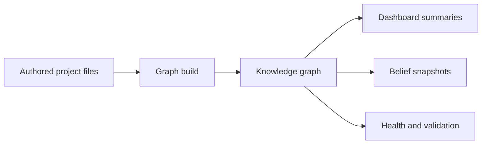

# Science Model

Science represents research as authored project files plus derived views over
those files. The model is designed for work where claims are uncertain, evidence
has provenance, and the current state of belief should remain inspectable.

## Big Picture



The authored files are the source of truth. The graph, summaries, snapshots, and
health outputs are derived readings of those files.

## Substrate

The substrate is the storage and representation layer:

- Markdown entity files with YAML frontmatter for durable authored records.
- Bibliography and source records for provenance.
- Graph materialization into named graph files under `knowledge/`.
- Derived reports, dashboards, health checks, and snapshots.

Science uses the graph as a queryable view, not as the primary authoring surface.

## Entities And Relations

An entity is a typed record such as `hypothesis:h01-example`,
`proposition:example`, `evidence-line:example`, `dataset:example`, or
`paper:Example2026`. Relations connect entities: a question can be addressed by
a proposition, an evidence line can support or dispute a proposition, and a
workflow run can produce a data package.

Entities are grouped into broad classes:

- **Epistemic:** records that carry or organize uncertain knowledge.
- **Operational:** work products, sources, datasets, plans, runs, and project
  machinery.
- **Reference:** concepts, variables, outcomes, topics, articles, and other
  referenced objects.

The built-in core profile is the durable descriptor source for core entity-kind
facts. Kind descriptors declare the category, entity class, optional markdown
home and filename strategy, default and allowed statuses, shortform aliases, and
template readiness. Tooling derives its kind maps from those descriptors so the
model registry, graph loader, CLI paths, and validation checks do not maintain
separate source-of-truth tables.

## Epistemic Neighborhoods

Science's working model is a federated patchwork of small epistemic
neighborhoods. A neighborhood is a local cluster around some research concern:
a question, hypothesis, proposition, inquiry, dataset, method, evidence cluster,
or analysis result.

Each neighborhood can carry:

- domain objects and variables;
- propositions about those objects;
- evidence lines and observations;
- provenance for sources and methods;
- derived belief and uncertainty;
- links to neighboring questions, projects, or shared vocabularies.

This is the user-facing version of the `h00` working model. The full `h00`
artifact remains a design and research record; this guide teaches the stable
operational shape.

## Project And Domain Boundaries

Science separates several surfaces:

| Surface | Purpose |
|---|---|
| Domain | The real-world objects, variables, systems, and concepts being studied. |
| Epistemic | Propositions, hypotheses, evidence, observations, inquiries, and belief state. |
| Operational | Tasks, plans, datasets, workflow runs, methods, sources, and project machinery. |
| Reference | Stable identifiers for cited or reused concepts, topics, variables, outcomes, and articles. |
| Generated | Graphs, dashboards, snapshots, grounding reports, and health outputs derived from authored state. |

Keeping these surfaces separate makes it harder to accidentally treat a source,
task, or generated report as evidence by itself.

## Federation

Science projects can connect through peers and shared references. The long-term
shape is:

```text
patch subset project subset project collection
```

Within one project, patches help local reasoning stay interpretable. Across
projects, federation lets related patches and references be compared or synced
without flattening every project into one undifferentiated graph.
